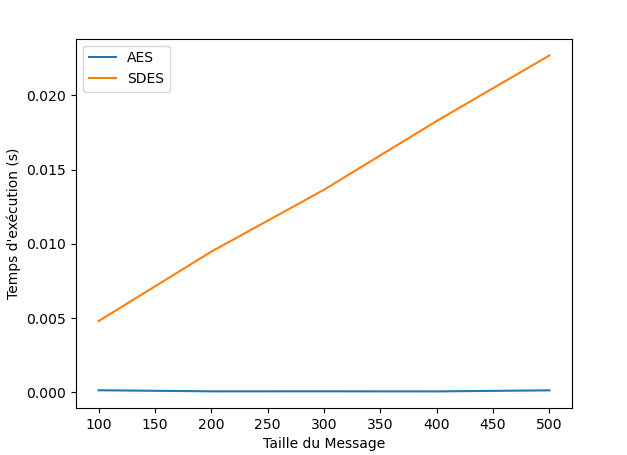

# Partie 2

# Question 1:
    L'alghorithme AES prend une clé de taille 256 bits qui est beaucoup plus grand que l'alghorithme SDES qui lui utilise une clé de 10 bits et dans lequels il y a 2 bits qui ne change pas et qui fait que la clé est de taille 8 bits. Nous devons donc faire tourner nos clé sur une boucle beaucoup plus grandes et donc qui prend plus de temps.

# Question 2 :
    AES est généralement plus rapide que SDES en raison de sa complexité structurelle, de ses blocs de données plus grands et de la possibilité d'utiliser des clés plus longues. 
    En éxécutant le fichier arsene_lupin :
        AES Time: 0.0006282329559326172
        SDES Time: 0.08947396278381348

